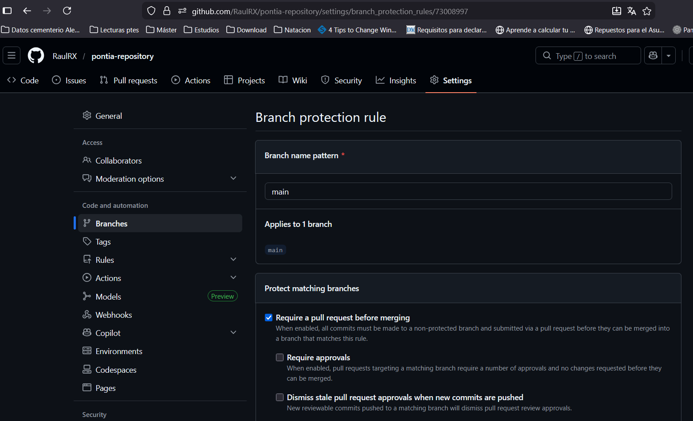
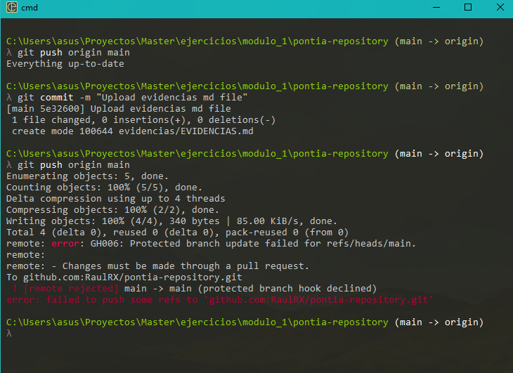
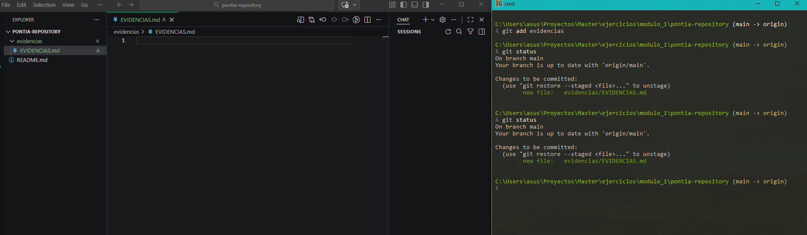
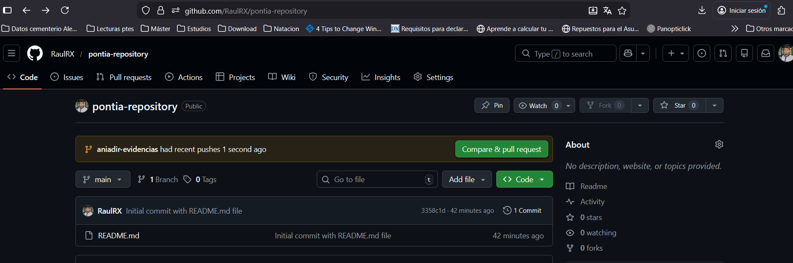
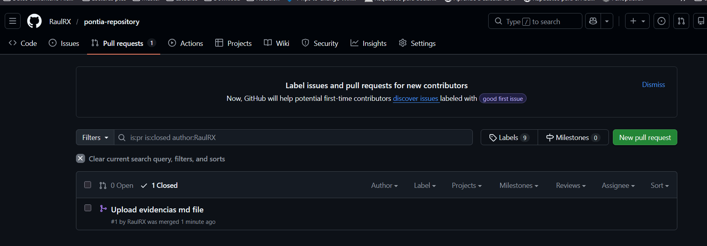

# Evidencias restricciones rama main

### 1. Paso a paso para configurar las restricciones sobre la rama main 
En primer lugar, una vez creado el repositorio git, y configurar las restricciones siguientes:

- Evitar realizar acciones push sobre la rama main directamente
- Añadir cambios a la rama *main* exclusivamente mediante pull request

1. Primero he ido a la configuración de las ramas en Github y he seleccionado la opción *Required a pull request before merging* asociado a la rama main, la cual queremos restringir

Para verificar que se ha aplicado correctamente la configuración, he intentando realizar push sobre la rama *main* y he obtenido el siguiente resultado

2. Ahora, otra comprobación realizada ha sido:

- Crear una nueva rama llamada *aniadir_evidencias*. En ella, hemos añadido la carpeta evidencias con el fichero **EVIDENCIAS.md**
- Crear un commit en la rama y pushear ese cambio al repositorio Github (**imagen_1** y **imagen_2**)
- Verificar que github nos sugiere crear un pull request desde la nueva rama *aniadir_evidencias* a la rama *main* (**imagen_3**)
- Por ultimo, aceptar la pull request generada y mergearla en la rama *main* (**imagen_4**)

##### - imagen_1: Commit en la rama *aniadir_evidencias* de la carpeta evidencias

##### imagen_2: Pushear el commit a Github, creando la nueva rama *aniadir_evidencias*

##### imagen_3: Aviso de Github de crear el pull request de la nueva rama *aniadir_evidencias*

### imagen_4: Aceptar y cerrar el pull request para mergear los cambios en la rama *main*

### 2. ¿Por qué es recomendable proteger la rama principal en un proyecto real?

La razón es la siguiente: En un proyecto real habrá muchos colaboradores trabajando en un mismo repositorio. Si todos los colaboradores suben cambios del proyecto sobre la rama main, esto puede provocar un crecimiento descontrolado y cometer errores. Además, imposibilita el trabajo en paralelo por parte de los colaboradores, haciendo muy poco eficiente el trabajo diario

Con pull request, evitamos un mayor número de errores al verificar los cambios de otros colaboradores, además de hacer más eficiente el trabajo en paralelo.

# Justificación del uso del fichero *.gitignore*

El fichero *gitignore* permite a git no rastrear carpetas o ficheros que no queremos tener en cuenta a la hora de subir cambios al repositorio.

La gran ventaja es no almacenar ficheros o carpetas que consumen almacenamiento innecesario, los cuales pueden ser muy pesados (Ejemplo: node_modules o pycache)

